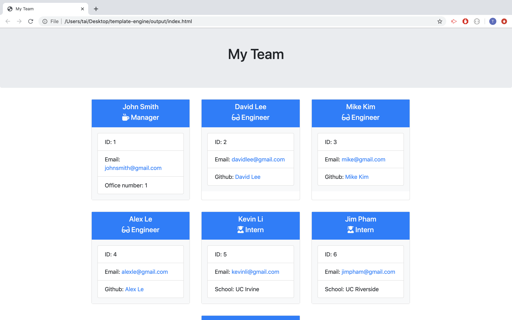

# template-engine

# Summary
    - This is a team generator. It will generate manager, engineer and intern using node.js

# Techonologoies Used
    - Bootstrap: for responsiveness of the page.
    - NPM: to install inquirer.
    - Git: to commit and push.
    - Node.js: to run the script.
    - Path: to 

# Site Picture and PDF


# Code Snippet
```js
const [
    managerTemplate,
    internTemplate,
    engineerTemplate,
    mainTemplate
  ] = await Promise.all([
    readFile(path.resolve(templatesDir, 'manager.html'), 'utf8'),
    readFile(path.resolve(templatesDir, 'intern.html'), 'utf8'),
    readFile(path.resolve(templatesDir, 'engineer.html'), 'utf8'),
    readFile(path.resolve(templatesDir, 'main.html'), 'utf8')
  ]);

  html.push(
    employees
      .filter(employee => employee instanceof Manager)
      .map(employee => {
        let template = managerTemplate;
        for (const key in employee) {
          template = replacePlaceholder(template, key, employee[key]);
        }
        return template;
      })
      .join('')
  );
```

To push all the input from node.js to HTML

# Author Links
[LinkedIn](www.linkedin.com/in/tu-tai-le-2a9646139)
[GitHub](https://github.com/TaiLe96/template-engine)